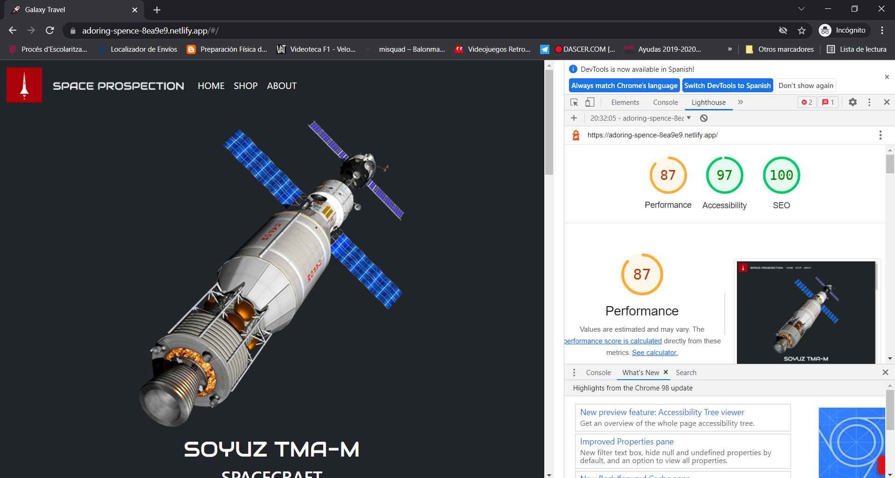
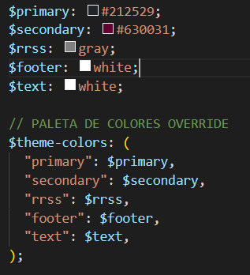

## © SANTI MARTÍNEZ AND KIM ASIAO

## ASIGNATURA
### DIW - DWEC

## ENLACE NETLIFY: 

## LIGHTHOUSE: FRONT PAGE

### PALET

Se han editado la paleta de colores que usaba Bootstrap por defecto para adecuarla a las necesidades de la página. Los
colores son los siguientes:

El primario destaca en las páginas de blog.html y contact.html, las cuales no usan un fondo de color fijo; el secundario
es el color granate usado para algunos div y botones, en sustitución de la clase -danger; el de RRSS simplemente es un
tono gris que se usa en un div y en las letras de los h1; por último, tanto footer como text ocupan el mismo color, sólo
que he definido dos variables distintas por si acaso quisiera cambiar el color de las letras o del footer no afectara a
todo.

## PRINCIPIOS UX
- Visualmente coherentes: utilizamos una paleta de colores (ver apartado anterior)
- Somos claros: 
  * No utilizamos colores estridentes.
  * Utilizamos botones, el navbar y headings. 
  * Además, utilizamos un lenguaje visual intuitivo. Por ejemplo, en la página 'Shop' utilizamos el icono del carrito junto al texto 'Comprar'.
  * Por otro lado, adecuamos la calidad de las imágenes según el uso que le damos, es decir, el tamaño y la calidad de las imágenes de las cards 
    no es la misma que en el caroussel. 
  
- Ayudamos al usuario: le damos la posibilidad de escapar del checkout de la compra con el botón 'atrás'.
- Desde nuestro punto de vista, facilitamos la navegación al usuario ya que es intuitivo.

## UX ACCESIBLE
- Los links son distinguibles.
- Los links tienen un hoover de un color diferente al pasar por encima.
- El puntero se convierte en un dedo al pasar por encima de algún link.
- Utilizamos un `<h1>` en cada página. 
- Titulamos las secciones con `<h2>`, de esta manera indicamos y ordenamos las ideas por relevancia.
- Los usuarios pueden ver los contenidos con claridad, incluso aquellos con dificultades en la vista.

## MEJORAS
Las páginas presentan una serie de cambios para mejorar la experiencia de usuario:
- En el responsive de la página 'Shop', el carrito es un modal: al darle al botón del carrito aparece y al darle a la x se esconde.
- Al hacer el checkout, hemos añadido el botón atrás y al finalizar la compra, te redirige a otra página con la confirmación de la compra del usuario y 
  un resumen de los productos que ha comprado.

## PROBLEMAS ENCONTRADOS

En relación a los iconos proporcionados por Font Awesome, en local todos funcionan correctamente pero, sin embargo, en Netlify funcionan algunos en concreto y otros no.
En el navegador se refleja que hay un problema con el CDN de Font Awesome pero, sin embargo, funcionan menos algunos. La única explicación racional es que la versión de algunos iconos
no es admitida por el despliegue y por eso sucede este error. 

Otra observación a tener en cuenta es el footer. Por lo que hemos podido observar, Vue tiene su propio footer pero que no requiere un uso obligatorio de este, por lo que hemos optado
por emplear un footer convencional mediante Bootstrap. Sin embargo, hemos tenido que realizar una serie de cambios en el CSS para que el footer permanezca en el bottom de la página en cualquier tipo de vista.
  
